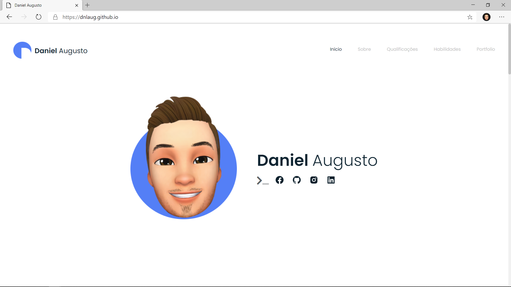

<!-- PROJECT LOGO -->
 

  

  <h3 align="center">Daniel Augusto - Portfolio Page</h3>

  

    A simple portfolio page made with HTML, CSS and JS with my ideas, repos and other projects!
     
    <a href="https://github.com/dnlaug"><strong>Explore all repos »</strong></a>
     
     
<!--     <a href="https://github.com/dnlaug/dnlaug.github.io">View Docs</a> -->
  

<!-- TABLE OF CONTENTS -->

  
Table of Contents

  <ol>
    <li>
      <a href="#about-the-project">About The Project</a>
      <ul>
        <li><a href="#built-with">Built With</a></li>
      </ul>
    </li>
    <li><a href="#license">License</a></li>
    <li><a href="#contact">Contact</a></li>
  </ol>

<!-- ABOUT THE PROJECT -->
## About The Project

### Built With

* [HTML 5](https://developer.mozilla.org/pt-BR/docs/Web/HTML/HTML5)
* [CSS 3](https://developer.mozilla.org/pt-BR/docs/Web/CSS)
* [JavaScript](https://developer.mozilla.org/pt-BR/docs/Web/JavaScript)

<!-- LICENSE -->
## License

Distributed under the MIT License. See `LICENSE` for more information.

<!-- CONTACT -->
## Contact

Daniel Augusto - [@daugusto](https://linkedin.com/in/daugusto)

Project Link: [https://github.com/dnlaug/dnlaug.github.io](https://github.com/dnlaug/dnlaug.github.io)
